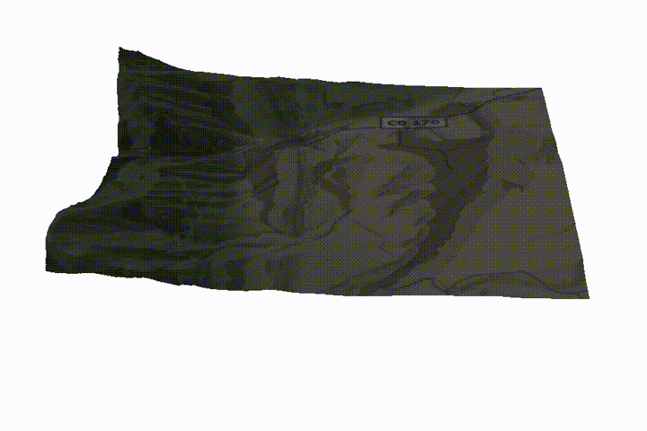

# TerrainShade
TerrainShade is an interactive web application that lets you see where there's sun and shade for any location on earth at any time.  At least that's the goal.

* When will the sun hit my favorite crag and make climbing unbearably hot?
* When should we stage our family photo in order to get that awesome low angle light?
* When is the sun going to hit the slope and turn the firm snow into mush?

These are the questions that TerrainShade will help answer.

### Under The Hood

The two technologies that make this possible are:

1. the elevation tiles provided by [Mapzen](https://mapzen.com) (https://mapzen.com/blog/elevation/)
2. the ray shading capabilites of [three.js](https://threejs.org/)

Other than that, the app is built with modern javascript tools - ES6, React, webpack.

### Running

To run the app on your local machine, you need the [npm](https://docs.npmjs.com/getting-started/installing-node) command line tool, which comes with an install of node.js:

* [node.js](https://docs.npmjs.com/getting-started/installing-node)

In the root directory, install the dependencies with:

    $ npm install
This will download and install the dependencies in `./node_modules`

Compile and bundle the code:

    $ npm run bundle
This will start a process that watches for changes to the source code and creates a new bundle in `./dist` whenever changes are detected.

Now you need to serve the `index.html` file and view it in your favorite browser. I use the [SimpleHTTPServer](https://docs.python.org/2/library/simplehttpserver.html) that comes with Python:

    $ python -m SimpleHTTPServer 8000

which serves the app at `http://localhost:8000/`
